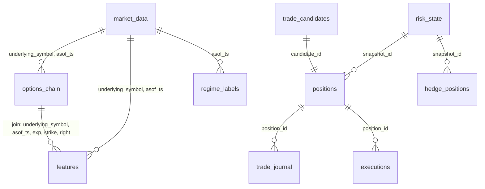

# QuantOptionAI — TECNICO (Specifiche Implementative)
_Versione: v.T.11.13

---

## v.T.11.3 — Anti-Leakage Policy (Regime Classifier)

**Rischio**: look-ahead bias se i percentili rolling (252g) sono calcolati su tutto il dataset (incluso futuro).

**Regola obbligatoria (WFA / folds)**:
- per ogni fold `F`: calcolare percentili/threshold **solo su IS_F**
- applicare tali threshold a `OOS_F` senza aggiornamenti con dati futuri

Pseudo:
- `thresholds_F = percentile(IS_F)`
- `apply thresholds_F to OOS_F`

**Test obbligatorio**: `F2-T_leakage_guard` (vedi 02_TEST.md).

---

## v.T.11.3 — HMM Early-Warning: Claim & Validazione OOS

Il modello HMM *può* fornire segnali anticipatori in specifici regimi, ma non è garantito “1–2 giorni prima” in modo generale.

**Validazione richiesta**: test OOS event-based su shock storici catalogati:
- Feb 2018 (Volmageddon)
- Mar 2020 (COVID crash)
- Mar 2023 (SVB / banking stress)

Definizione early-warning: segnale in finestra `[-2, 0]` giorni dall’inizio evento.

**Acceptance** (default):
- detection ≥ `2/3` eventi
- FPR (fuori eventi) sotto soglia definita in test

---

## v.T.11.3 — VaR/CVaR Performance Budget

La calibrazione Heston e/o MC full repricing devono rispettare un budget runtime dichiarato in test (`PERF_VaR_runtime_budget`).

---

## v.T.11.3 — Broker Reconciliation (IBKR)

Obbligatorio workflow di reconciliation P&L:
- import statement (IBKR CSV/Flex)
- match per trade_id
- confronto qty/price/fees/P&L (realized/unrealized)
- mismatch report con tolleranza

Assenza reconciliation → run non certificabile.

---

# QuantOption AI v11.1 — ALLEGATO TECNICO (Canonico)

ALLEGATO TECNICO — QuantOption AI v11.1
Versione: v.T.11.12
Data: 2026-02-24
Destinatario: Implementatori, sviluppatori, quantitative analyst
INDICE ALLEGATO TECNICO
T1. Pricing Avanzato: Heston, SABR, SVI
T2. Feature Engineering Completo — 15+3 Core [v11.1]
T3. Architettura ML: Regime Classifier Ensemble [v11.1]
T4. Backtesting Anti-Overfitting: WFA e CPCV
T5. Risk Management Quantitativo: VaR, CVaR, Stress Test
T6. Market Microstructure e Execution [v11.1]
T7. Pipeline Dati: Schema, Quality Framework, Monitoring [v11.1]
T8. Parametri WFA Validati — Dettaglio Completo
T9. Stack Tecnologico e Librerie [v11.1]
T10. Note Implementative e Semplificazioni Applicate
T11. Riferimenti e Risorse
T1. PRICING AVANZATO: HESTON, SABR, SVI
T1.1 Limiti Black-Scholes

Limite BSM	Errore Pratico	Impatto P&L
Vol costante	Ignora smile: put OTM underpriced	-15/-25% annuo
Distribuzione normale	Sottostima code	DD sottostimato 30-40%
No term structure	Calendar spread errati	10-20% pricing error
No stochastic vol	Ignora correlazione spot-vol	Delta/Vega sbagliati in shock
T1.2 Modello Heston (1993)
Equazioni:
```
dS = μ·S·dt + √v·S·dW₁
dv = κ·(θ−v)·dt + ξ·√v·dW₂
dW₁·dW₂ = ρ·dt
Parametri:

Parametro	Simbolo	Range	Interpretazione
Mean reversion	κ	0.5–5.0	Velocità ritorno long-run
Long-run var	θ	0.01–0.25	Varianza equilibrio
Vol-of-vol	ξ	0.1–2.0	Curvatura smile
Correlazione	ρ	-0.9/-0.3	Effetto leva
Var iniziale	v₀	≈ IV_ATM²	Condizione iniziale
Calibrazione: Levenberg-Marquardt su QuantLib, 2-10 sec/sottostante, ricalibrazione giornaliera.
```
T1.3 SABR e T1.4 SVI
[Invariati rispetto v11.0 — vedi documento originale]
T2. FEATURE ENGINEERING — 15+3 CORE [v11.1]
T2.1 Categoria A — Volatilità (5 features)

#	Feature	Formula	Interpretazione
1	IV Rank	(IV_oggi − IV_min_52w) / (IV_max_52w − IV_min_52w)	0=min, 1=max
2	IV Percentile	% giorni 252g con IV < IV_oggi	Robusto agli outlier
3	IV30/HV30	IV 30d / HV Yang-Zhang 30d	>1.2: vendere vol
4	VIX Term Slope	(VIX9D − VIX3M) / VIX3M	Contango vs backwardation
5	Skew 25-delta	IV(put 25d) − IV(call 25d)	Domanda protezione
T2.2 Categoria B — Options Chain (5 features)

#	Feature	Formula	Soglia
6	Put/Call Ratio Volume	Vol put / Vol call	>1.2: bearish
7	Gamma Exposure (GEX)	Σ(Gamma × OI × 100 × S²/100)	Pos/Neg
8	Open Interest strike	OI per strike	>100: entry possibile
9	Volume/OI Ratio	Volume giornaliero / OI	>0.5: attività insolita
10	Bid-ask spread %	(ask−bid)/mid	<2% ATM, <5% OTM
T2.3 Categoria C — Regime Macro (5 features)

#	Feature	Fonte	Interpretazione
11	VIX/VIX3M Ratio	CBOE	<0.85: normale, >1.0: stress
12	Credit Spread HY-IG	FRED	Risk-off leading
13	Days to FOMC	Fed calendar	<2: No-Trade Zone
14	Earnings Season Flag	SEC EDGAR	Ridurre esposizione
15	GARCH(1,1) forecast	arch library	vs IV per edge
T2.4 Categoria D — Microstructure [v11.1] (3 features)

#	Feature	Formula	Implementazione
16	Volume Profile Delta	(Vol_bid − Vol_ask) / Total_Vol	Richiede L2 data o proxy da tick
17	OI Change Velocity	ΔOI / OI_lag × 100, rolling 3g	Institutional flow detection
18	IV Curvature Acceleration	Δ²Skew/ΔK², rolling 5g	Leading indicator stress
Note implementative v11.1:
Volume Profile: Se L2 non disponibile, proxy = put/call volume ratio per strike
OI Velocity: Calcolabile con dati EOD, alert se >2σ
IV Curvature: Derivata seconda numerica della skew, smoothing con Savitzky-Golay
T3. ARCHITETTURA ML — REGIME CLASSIFIER ENSEMBLE [v11.1]
T3.1 Modello Primary: XGBoost

Componente	Dettaglio
Algoritmo	XGBoost Classifier
Target	3 classi (NORMAL, CAUTION, SHOCK)
Hyperparameters	n_estimators=100, max_depth=4, lr=0.05, subsample=0.8
Feature selection	Top 10 SHAP
Calibrazione	Platt Scaling + 5-fold Purged CV
Frequenza training	Mensile WFA
T3.2 Modello Secondary: HMM [v11.1]
```python
from hmmlearn import hmm

# Modello 3 stati nascosti
model = hmm.GaussianHMM(n_components=3, covariance_type="full")
observations = np.column_stack([vix, vix3m, iv_rank, credit_spread])
model.fit(observations)

# Decodifica stato corrente
hidden_states = model.predict(observations)
transition_matrix = model.transmat_
Integrazione Ensemble:
Se XGBoost = CAUTION e HMM P(Shock) > 0.7 → upgrade a SHOCK
Se XGBoost = NORMAL e HMM P(Shock) > 0.5 → upgrade a CAUTION
Peso finale: 70% XGBoost, 30% HMM (ottimizzato WFA)
```
T3.3 Trade Opportunity Scorer
Filtri Hard e Score Composito (4 pilastri) — [Invariati, vedi Master]
Kelly Fractional v11.1:
```python
def kelly_fractional(p, b, skewness, capital, min_trade_pct=0.5):
    f_star = (p * b - (1 - p)) / b
    # Half-Kelly
    f = 0.5 * f_star
    # Skewness adjustment
    if skewness < -1.0:
        f *= 0.8
    # Lower bound check
    if f < min_trade_pct / 100:  # es. f < 0.005
Nota: il confronto deve essere espresso direttamente su f (capital si semplifica), per chiarezza e correttezza semantica.
        return 0  # NO TRADE
    return min(f, 0.25)  # Max 25%
```
T4. BACKTESTING ANTI-OVERFITTING: WFA E CPCV
T4.1 Bias da Eliminare

Bias	Causa	Soluzione
Look-ahead	Dati futuri in feature passate	.shift(1) sistematico
Survivorship	Solo titoli sopravvissuti	ETF stabili o dataset con delisting
In-sample overfitting	Ottimizzazione su tutto il set	WFA obbligatoria
Transaction cost	Commissioni ignorate	1 tick slippage + commissioni reali
Multiple testing	Centinaia di parametri	Correzione Bonferroni/FDR
Bid-ask IV	Uso mid IV	Ask per buy, Bid per sell
T4.2 Walk-Forward Analysis (WFA)

Parametro	Valore
Finestra IS	3 anni
Finestra OOS	1 anno
Rolling step	Annuale
Periodo totale	2010-2024
Fold OOS	10
T4.3 CPCV — Combinatorial Purged Cross-Validation
Implementazione Lopez de Prado:
```python
from mlfinlab import cross_validation as cv

cpcv = cv.CombinatorialPurgedKFold(
    n_splits=10,
    n_test_splits=2,
    embargo_pct=0.083  # 21 giorni
)
Parametri v11.1:

Parametro	Valore	Rationale
N splits	10	Granularità vs computazione
N test splits	2	Test set sufficiente
Embargo	21 giorni	Elimina autocorrelazione 1m
Min observations	30	Significatività statistica
```
T4.4 Criteri di Accettazione

Metrica	Soglia	Motivazione
Sharpe OOS	≥ 0.8 (Condor), ≥ 0.6 (Bull Put)	Minimo retail
IS/OOS Deflation	≥ 0.60	Anti-overfitting
Anni OOS negativi	Nessuno > -20%	Resilienza
Consistenza fold	≥ 7/10 positivi	Stabilità
PSR	P(SR>0) > 95%	Significatività
T5. RISK MANAGEMENT QUANTITATIVO
T5.1 VaR Full Repricing
Algoritmo Monte Carlo:
```python
def compute_portfolio_var(positions, n_scenarios=10000, alpha=0.99, horizon=5):
    pnl_scenarios = []
    for _ in range(n_scenarios):
        # Simula Heston o GBM
        dS, dVol = simulate_heston_scenario(...)
        # Full repricing
        pnl = sum(reprice_option(pos, dS, dVol) for pos in positions)
        pnl_scenarios.append(pnl)
    
    var_99 = -np.percentile(pnl_scenarios, 1)
    cvar_99 = -np.mean([p for p in pnl_scenarios if p < -var_99])
    return var_99, cvar_99
```
T5.2 CVaR Target

Aspetto	Target
CVaR 99% settimanale	≤ 5% capitale
CVaR vs VaR	Tipicamente 30-50% superiore
T5.3 Stress Test Storici

Scenario	Data	Max Loss Accettabile	Max Loss con Hedge
COVID Crash	Feb-Mar 2020	-15%	-12%
GFC Phase 1	Set-Ott 2008	-15%	-12%
Volmageddon	5 Feb 2018	-8%	-6%
Flash Crash	6 Mag 2010	-5%	-4%
Bear 2022	Gen-Ott 2022	-8%	-6%
SVB Collapse	Mar 2023	-4%	-3%
T5.4 Tail Risk Hedging
Strumento unico v11.1: Put Spread OTM mensile (5% OTM / 15% OTM)
Costo: 1.0-1.5% annuo
Budget: ≤ 20% del theta mensile incassato
T6. MARKET MICROSTRUCTURE E EXECUTION [v11.1]
T6.1 Anatomia del Bid-Ask Spread
Fattori impatto:
Liquidità sottostante
Distanza OTM
Tempo a scadenza
Volatilità di mercato
Ora del giorno
T6.2 Protocollo Esecuzione v11.1
Smart Limit Order Ladder:

Step	Prezzo	Timeout	Fallback
1	Mid	2 min	Step 2
2	Mid - 1 tick	2 min	Step 3
3	Mid - 3 tick	2 min	Step 4
4	Mid - 5 tick	2 min	Step 5
5	Abbandono	—	Rivaluta domani
TWAP per Spread Ampio [v11.1]:
```python
def execute_twap_combo(order, n_slices=3, interval_min=5):
    if spread > 0.50 and strategy == "Iron Condor":
        slices = split_order(order, n_slices)
        for slice in slices:
            execute_limit(slice)
            sleep(interval_min * 60)
Queue Position Awareness [v11.1]:
Se dati Level 2 disponibili (IBKR API), verifica posizione coda
Entra solo se position < 5 (alta probabilità fill)
```
T6.3 TCC — Total Cost of Carry

Strategia	Gambe	Commissione	Slippage	TCC Totale	Credito Min (3×)
Bull Put IWM	2	$1.50	$2-5	$4-7	$12-21
Iron Condor IWM	4	$2.60	$5-10	$8-13	$24-39
CSP (Wheel)	1	$0.65	$1-3	$2-4	$6-12
Iron Condor SPY	4	$2.60	$8-20	$11-23	$33-69
Preferenza IWM: Slippage 30-50% inferiore vs SPY
T7. PIPELINE DATI [v11.1]
T7.1 Schema Database


## T7.1bis — Relazioni & Vincoli (ERD logico)



FK logiche minime:
- options_chain(underlying_symbol, asof_ts) → market_data(underlying_symbol, asof_ts)
- features(underlying_symbol, asof_ts) → market_data(underlying_symbol, asof_ts)
- positions(candidate_id) → trade_candidates(candidate_id)
- trade_journal(position_id), executions(position_id) → positions(position_id)

Tabelle principali (invariato) + campi v11.1:

Tabella	Aggiunte v11.1
features	volume_profile_delta, oi_velocity, iv_curvature_accel
regime_labels	hmm_state, hmm_prob_shock, transition_prob_caution_shock
trade_candidates	kelly_fraction, kelly_lower_bound_flag
monitoring	psi_score, csi_score, model_drift_flag
T7.2 Data Quality Framework
Checks automatici esistenti + v11.1:

Check	Condizione	Azione
PSI Feature Drift [v11.1]	PSI > 0.25	Alert, retraining
CSI Characteristic Drift [v11.1]	CSI > 0.10	Review feature
IV Curvature anomalia	> 3σ vs 30g	Verifica manuale
T7.3 Monitoring v11.1

Metrica	Soglia	Azione
Latenza ingestion	> 30 min	Alert Telegram
Dati mancanti	> 5% strike	Solo chiusure
Model drift (accuracy)	< 55% (20g)	Blocco segnali
PSI drift [v11.1]	> 0.25	Retraining
P&L deviation	Sharpe < 0.5 (30g)	Review completa
Kill Switch	File lock o DD ≥ 30%	Blocco totale
T8. PARAMETRI WFA VALIDATI
T8.1 Iron Condor IWM

Parametro	Ottimale	Range	Sensibilità
DTE	38	30-45	Alta
Delta short	±0.16	±0.12/±0.20	Media
Width	5	4-7	Bassa
IVR min	45	40-55	Alta
Take Profit	50%	45-55%	Bassa
Stop Loss	200%	150-250%	Alta
Time Stop	21	18-24	Media
Distribuzione Sharpe OOS (10 fold):
Mediana: 0.92
5° percentile: 0.71
95° percentile: 1.18
T8.2 Bull Put Spread
[Invariato, vedi Master]
T8.3 Matrice Regime → Strategia
[Invariata, vedi Master]
T9. STACK TECNOLOGICO [v11.1]

Layer	Tool	Versione	Costo
Linguaggio	Python	3.11+	€0
Dati	yfinance, CBOE, FRED	latest	€0
Pricing	QuantLib-Python	1.32+	€0
Volatilità	arch	6.x	€0
ML	XGBoost, hmmlearn [v11.1]	2.0+, 0.3+	€0
Interpretabilità	shap	0.44+	€0
Backtesting	vectorbt	0.26+	€0
Validazione	mlfinlab	0.15+	€0
Accelerazione	numba	0.59+	€0
Broker API	ib_insync	0.9.86+	€0
Dashboard	Streamlit	1.28+	€0
Database	DuckDB (DEV e single-operator OPERATIONAL, primario); PostgreSQL (OPERATIONAL multi-user / audit esterno, opzionale)	—	€0
Alert	Telegram Bot API	—	€0
Infrastruttura	VPS / Raspberry Pi 4	—	<€10/m
Aggiunte v11.1: hmmlearn per HMM ensemble
T10. NOTE IMPLEMENTATIVE
T10.1 Ordine di Priorità (Non Negoziabile)

Priorità	Componente	Output	Dipendenze
1	Pipeline dati + database	IVR automatico	—
2	Regime base + HMM [v11.1]	Regime corretto 5g	Pipeline
3	Backtest Bull Put WFA	Sharpe > 0.6	IVR, regime
4	Paper trading IBKR	60g, win rate > 55%	Backtest
5	Scoring + Kelly [v11.1]	Miglioramento > 0.1	Paper
6	Microstructure features [v11.1]	Raffinamento	Sistema stabile
T10.2 Semplificazioni v11 → v11.1

Componente v11	v11.1	Rationale
XGBoost solo	XGBoost + HMM ensemble	Early warning shock
15 features	15 + 3 microstructure	Timing entry migliorato
Kelly base	Kelly fractional + lower bound	Protezione overtrading
Limit order base	Smart Ladder + TWAP	Slippage ridotto
T10.3 Cosa NON è Cambiato (Rigore Mantenuto)
WFA obbligatoria ✅
CPCV per ML ✅
Human-in-the-loop ✅
TCC filter hard ✅
3-layer DD control ✅
Kill switch ✅
T10.4 Checklist 90 Giorni v11.1

Settimana	Focus	Deliverable	Validazione
1-2	Setup, pipeline	IVR match ORATS	<5% discrepanza
3-4	Regime + HMM [v11.1]	WFA 5 fold	Sharpe > 0.5
5-6	IBKR paper	5 trade	Zero errori
7-10	Scoring + Kelly [v11.1]	Confronto regime	ΔSharpe > 0.1
11-12	Microstructure [v11.1]	Feature integration	Stabilità
13+	Paper 60g completo	Journal, metriche	GO/NO-GO
T11. RIFERIMENTI E RISORSE
T11.1 Bibliografia Essenziale

Autore	Titolo	Rilevanza
Sheldon Natenberg	"Option Volatility and Pricing"	Fondamento teorico
Dan Passarelli	"Trading Options Greeks"	Gestione greeks
Marcos Lopez de Prado	"Advances in Financial Machine Learning"	CPCV, PSR, anti-overfitting
Emanuel Derman	"My Life as a Quant"	Risk management culture
Rabiner [v11.1]	"A Tutorial on Hidden Markov Models"	HMM implementation
Biais et al. [v11.1]	"Market Microstructure"	Order flow models
T11.2 Risorse Online

Risorsa	URL	Utilizzo
CBOE VIX	cboe.com/tradable_products/vix	Regime data
FRED	fred.stlouisfed.org	Macro features
SEC EDGAR	sec.gov/edgar	Earnings
QuantLib	quantlib.org	Pricing
ib_insync	github.com/erdewit/ib_insync	Broker integration
hmmlearn [v11.1]	hmmlearn.readthedocs.io	HMM ensemble
FINE ALLEGATO TECNICO v11.1

## Addendum v.T.11.4 — Pricing, Kelly gate, Hedge scenarios, Margin Efficiency

### Pricing Engine (Operational)
**Obbligatorio**: fitting superficie IV con **SVI** (o spline con vincoli di stabilità).  
Motivazione: robustezza numerica + performance su dati retail noisy.

**Heston**: consentito solo per stress/scenario (one-shot), non per pricing operativo ricorrente.

### Kelly — Minimum Track Record Gate
- Condizione necessaria: `DATA_MODE == VENDOR_REAL_CHAIN`
- Condizione necessaria: `N_closed_trades >= 50`
- Se non soddisfatte → `Kelly_enabled = False` e sizing fixed fractional.

### Hedge Policy — Scenario Analysis
Definire e riportare per ogni run:
- Scenario Base (VIX shock moderato) → Loss attesa X
- Scenario Shock (tail) → Loss attesa Y
Vincolo: `Y <= ShockLossCap(tier)`

### Margin Efficiency (nuova metrica)
Definizione:
`MarginEfficiency = Return_annualizzato / Avg_Margin_Used`  
Da riportare nel journal e nei report (oltre a Sharpe/MaxDD).

### PERF_VaR_runtime_budget (quantificazione)
Budget di riferimento (retail):
- Portfolio: **≤ 10 posizioni**
- Scenari: **10.000**
- Target runtime: **≤ 5 secondi** (single run VaR/CVaR)

Se i limiti vengono superati (più posizioni o più scenari), il sistema deve:
- scalare (parallelizzazione / batching), oppure
- degradare in modalità approssimata (es. repricing semplificato), oppure
- fallire il gate di performance.

### TWAP/VWAP (tiering)
- STARTER-LITE: preferire ordine singolo o ladder aggressiva; slicing non obbligatorio.
- OPERATIONAL: TWAP (es. 3 slice) consentito solo se motivato da spread/size, con log dei slice e controllo slippage.

\
## Addendum v.T.11.7 — Validator (core behavior + false-positive guard)

Pseudo-implementazione core (hard stop su CRITICAL, non su WARNING):
```python
def validate_phase0(profile: str) -> Report:
    results = []
    blocked = False
    block_reason = None

    for check in CHECKLIST[profile]:
        result = check.run()
        results.append(result)

        if result.severity == "CRITICAL" and result.status == "FAIL":
            blocked = True
            block_reason = result.id
            break

    return Report(results=results, blocked=blocked, reason=block_reason)
```

Exit code mapping:
- PASS → 0
- WARNING-only failures → 2
- CRITICAL FAIL → 10

\
## Addendum v.T.11.7 — Adaptive Fixed Fractional (reference)

```python
from typing import Optional

def adaptive_fixed_fractional(
    base_pct: float,                # es. 0.05
    regime: str,                    # "NORMAL" | "CAUTION" | "SHOCK"
    n_closed_trades: int,
    data_mode: str,
) -> float:
    # NO Kelly pre-50 trade; questa funzione fornisce sizing conservativo.
    if n_closed_trades >= 50:
        raise NotImplementedError("Kelly allowed only with 50+ closed trades (VENDOR_REAL_CHAIN).")
    if data_mode != "VENDOR_REAL_CHAIN":
        # in synthetic non si certifica sizing economico: mantenere conservativo
        return 0.0

    mult = {"NORMAL": 1.0, "CAUTION": 0.5, "SHOCK": 0.0}[regime]
    return base_pct * mult
```

\
## Addendum v.T.11.7 — HMM qualification gate (ensemble upgrade)

HMM è **monitoring-only** finché non supera la qualification su famiglie di shock.

Regola decisionale (schema):
```python
def hmm_ensemble_qualification(events) -> bool:
    # events: lista eventi con label famiglia e window pre-evento
    fam_ok = set()
    hmm_leads = 0
    xgb_only = 0

    for ev in events:
        hmm = hmm_predict(ev.window_pre)
        xgb = xgb_predict(ev.window_pre)
        if hmm == "SHOCK" and xgb != "SHOCK":
            fam_ok.add(ev.family)
            hmm_leads += 1
        elif xgb == "SHOCK" and hmm != "SHOCK":
            xgb_only += 1

    # Qualifica se copre almeno 2 famiglie e aggiunge valore netto
    return (len(fam_ok) >= 2) and (hmm_leads > xgb_only)
```
Se fallisce: HMM resta monitoring-only (log probabilità, nessun trigger).

\
## Addendum v.T.11.7 — Correlation Regime Detector (SPY–TLT)

Definizione (schema):
```python
corr60 = rolling_corr("SPY", "TLT", window=60)
z = zscore(corr60, window=252)
flag = (z < -2.0)
# Se flag: ridurre sizing / vietare nuove posizioni short-vol
```


### Performance Budget — Degradation Policy

Se runtime VaR/CVaR > 5s (budget retail dichiarato):

```python
if runtime > 5.0:
    if can_approximate:
        use_approximate_repricing()  # es. BSM con vol shock deterministico
        log_warning("VaR approximated due to performance budget")
    else:
        raise PerformanceBudgetExceeded(
            "Ridurre numero posizioni o scenari"
        )
```
La modalità approssimata deve essere loggata e riportata nel journal.

### Chiarimento: sizing in DEV con DATA_MODE sintetico (engineering-only)

Per `DATA_MODE != VENDOR_REAL_CHAIN` alcune funzioni di sizing (es. `adaptive_fixed_fractional`) possono restituire `0.0` **per evitare qualsiasi interpretazione economica** di performance su dati sintetici.

In DEV è consentito usare un **sizing “virtuale/fittizio”** (config separata) **solo** per:
- test di integrazione end-to-end (P&L loop, journaling, report)
- validare plumbing / performance / UX

Questo sizing virtuale **non** è certificabile e **non** va usato per misurare edge o rendimenti.
